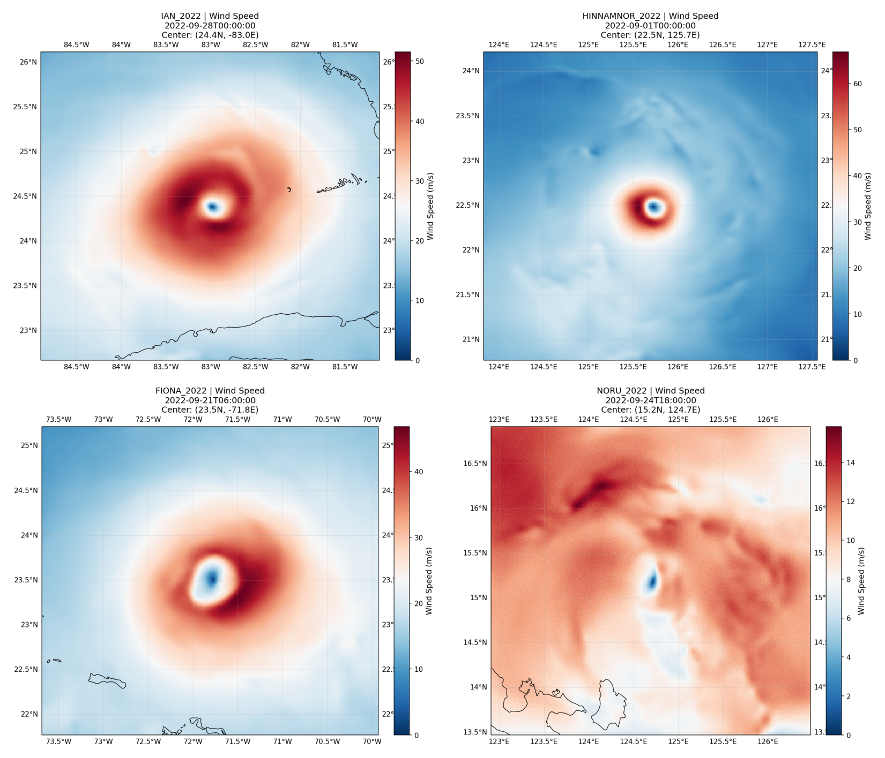

# QiFeng-CYGNSS: Kilometer-Scale Tropical Cyclone Vector Wind Dataset

<p align="center">
  
</p>

<p align="center">
  <em>Example reconstructions: Hurricane Ian (2022), Typhoon Hinnamnor (2022), Hurricane Fiona (2022), Typhoon Noru (2022).</em>
</p>

---

## Overview

This repository provides data access tools for the **QiFeng-CYGNSS** dataset — a collection of km-scale tropical cyclone (TC) 10-meter vector wind fields reconstructed from CYGNSS satellite observations using physics-constrained score-based diffusion assimilation.

**Key characteristics:**

| Property | Value |
|----------|-------|
| Spatial coverage | Storm-relative domain, 384 km × 384 km |
| Grid resolution | 1.5 km (256 × 256 pixels) |
| Temporal coverage | 2020–2022, all global TC basins |
| Number of TCs | ~290 named storms |
| Total snapshots | ~5,000 (6-hourly) |
| Variables | u10, v10 (10-m wind components), observation metadata |
| Format | NetCDF-4 (CF-1.8 compliant) |
| Size | ~2.9 GB |

## Dataset Access

The full dataset is archived on Zenodo:

[](https://doi.org/10.5281/zenodo.XXXXXXX)

## File Structure

```
QiFeng_CYGNSS_dataset/
├── IAN_2022.nc                  # Per-TC NetCDF files
├── HINNAMNOR_2022.nc
├── FIONA_2022.nc
├── ...                          # (~290 files total)
└── ensemble_uncertainty.nc      # Pixel-level ensemble spread (138 cases)
```

Each per-TC file contains:

| Variable | Dimensions | Description |
|----------|-----------|-------------|
| `u10` | (time, y, x) | 10-m eastward wind component (m/s) |
| `v10` | (time, y, x) | 10-m northward wind component (m/s) |
| `time` | (time,) | Analysis time |
| `center_lat` | (time,) | TC center latitude (°N) |
| `center_lon` | (time,) | TC center longitude (°E) |
| `ibt_vmax` | (time,) | IBTrACS best-track Vmax (knots) |
| `n_obs` | (time,) | Number of CYGNSS observations |
| `meets_ocs` | (time,) | Observation Coverage Sufficiency flag |
| `obs_wind_speed` | (time, n_obs_max) | CYGNSS wind speed per specular point |
| `obs_pixel_i` | (time, n_obs_max) | Observation pixel row on the 256×256 grid |
| `obs_pixel_j` | (time, n_obs_max) | Observation pixel column on the 256×256 grid |

## Quick Start

### Read a NetCDF file

```python
import netCDF4 as nc4
import numpy as np

ds = nc4.Dataset('IAN_2022.nc', 'r')
u10 = ds.variables['u10'][:]   # (time, 256, 256) in m/s
v10 = ds.variables['v10'][:]
ws = np.sqrt(u10**2 + v10**2)  # wind speed

print(f"Storm: {ds.storm_name}, Basin: {ds.basin}")
print(f"Snapshots: {u10.shape[0]}, Max wind: {np.nanmax(ws):.1f} m/s")
ds.close()
```

### Export to GeoTIFF

```bash
python export_tiff.py --input /path/to/dataset/ --output ./tiff_export/
python export_tiff.py --input IAN_2022.nc --output ./tiff_out/ --storm IAN_2022
```

See [`export_tiff.py`](export_tiff.py) for batch conversion of NetCDF snapshots to multi-band GeoTIFF (u10, v10, wind_speed).

### Visualization notebook

[`visualize_dataset.ipynb`](visualize_dataset.ipynb) demonstrates:
- Loading and inspecting per-TC NetCDF files
- Wind speed / vector field plotting
- Multi-panel TC evolution visualization
- Azimuthal-mean radial wind profiles
- Overlay of CYGNSS observations on reconstructed fields

## Grid Convention

- The grid is **storm-centric Cartesian**: pixel (128, 128) is the interpolated TC center.
- Row index increases **southward**, column index increases **eastward**.
- Physical coordinates can be computed from the TC center and 1.5 km pixel spacing.
- The `meets_ocs` flag indicates whether observation coverage is sufficient for reliable reconstruction (n_obs ≥ 300 AND azimuthal coverage ≥ 62.5%).

## Requirements

```
numpy
netCDF4
matplotlib
rasterio        # for GeoTIFF export only
```

## Citation

If you use this dataset, please cite:

```bibtex
@article{han2026qifeng,
  title={QiFeng-CYGNSS: A Kilometer-Scale Tropical Cyclone Vector Wind Dataset from Physics-Constrained Diffusion Assimilation of Spaceborne GNSS-R Observations},
  xxx
}
```

## License

This dataset is distributed under [CC BY 4.0](https://creativecommons.org/licenses/by/4.0/).
